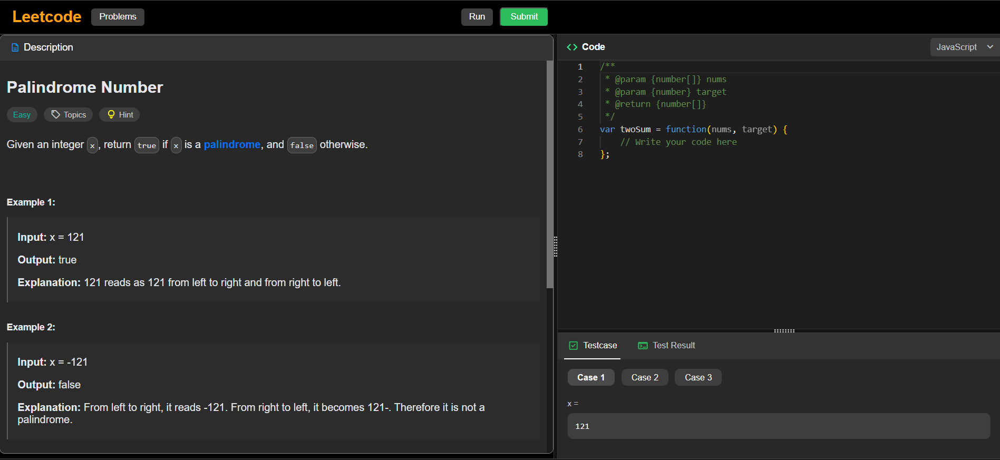
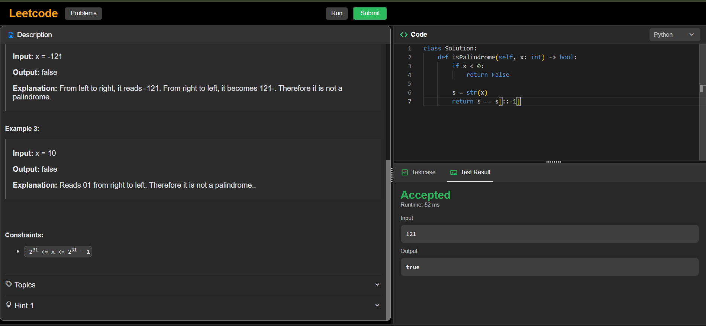

<div align="center">

#  LeetCode Clone

### Coding Practice • Problem Solving • Interactive UI

<p>
A web-based coding platform inspired by LeetCode that allows users to browse problems, write code, and practice problem-solving in an interactive environment.
</p>

<br/>

<a href="YOUR_LIVE_LINK_HERE" target="_blank">
  
</a>

<br/><br/>


</div>

---

## Overview

**LeetCode Clone** is a simplified coding platform that replicates the core experience of solving programming problems.

It allows users to read problem statements, write code in an editor, and practice logical problem-solving in a structured interface similar to competitive coding platforms.

---

## Screenshots

<div align="center">

| Problem List |
|--------------|
|  | 
| Code Editor |
| |

</div>

---

## Explanation of UI

- **Problem List Page**  
  Displays a list of coding problems with titles and difficulty levels. Users can select any problem to start solving.

- **Code Editor Interface**  
  Provides:
  - Problem description  
  - Input/output examples  
  - Code editor area  
  - Run/Submit options (if implemented)  

This layout mimics real coding platforms and enhances problem-solving experience.

---

## Key Features

- Browse coding problems  
- View problem descriptions and examples  
- Write and edit code in browser  
- Interactive UI for problem solving  
- Structured layout similar to coding platforms  
- Clean and minimal design  

---

## Technology Stack

<div align="center">

| Category | Technology |
|----------|-----------|
| Structure |  HTML |
| Styling |  CSS |
| Logic |  JavaScript |
| Editor |  Code Editor (Custom / Library) |

</div>

---

## Project Structure

```
06_leetcode_clone/
├── index.html
├── problem.html
├── style.css
├── script.js
├── assets/
│   ├── problems.png
│   └── editor.png
└── README.md
```

---

## How It Works

1. User opens the platform  
2. Views list of available problems  
3. Selects a problem  
4. Reads description and constraints  
5. Writes solution in editor  
6. (Optional) Runs or submits code  

---

## Getting Started

### Prerequisites

- Web browser  

---

### Installation

```bash
git clone https://github.com/priyanildz/LeetCode-Clone.git
cd LeetCode-Clone
```

---

## Run Project

Open:

```
index.html
```

in your browser

---

## Use Cases

- Practice coding problems  
- Learn problem-solving techniques  
- Build logic and algorithms  
- Understand frontend-based coding interfaces  

---

## Future Improvements

- Code execution backend (Node/Python sandbox)  
- User authentication  
- Problem difficulty filtering  
- Submission history  
- Leaderboard system  

---

## License

This project is licensed under the MIT License.

---

<div align="center">

Developed by  
<strong>priyanildz</strong>

</div>